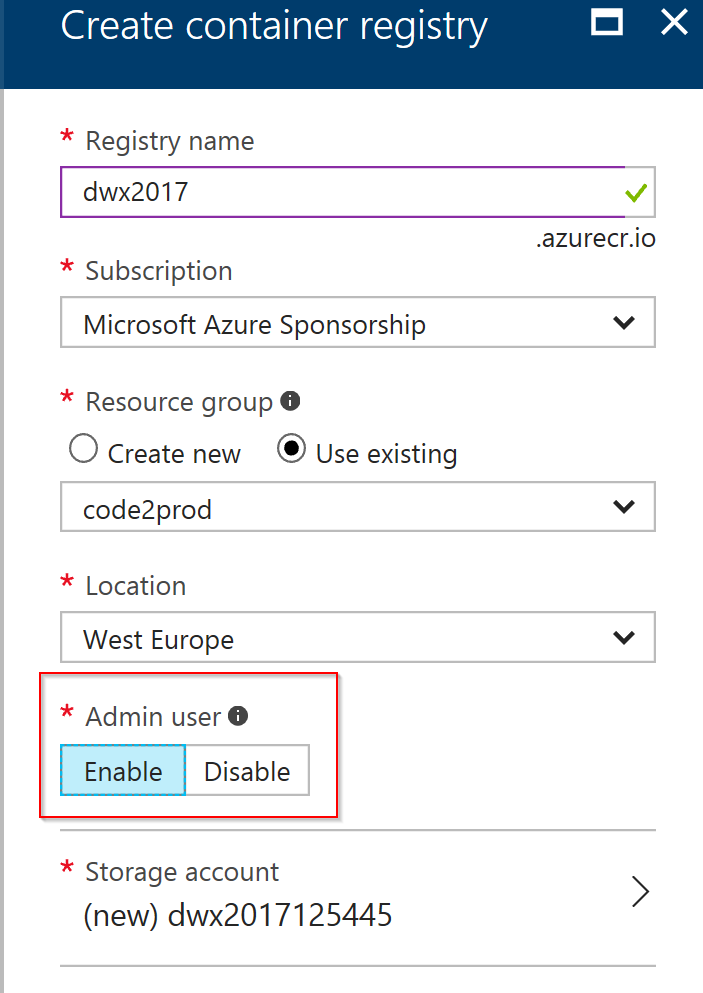
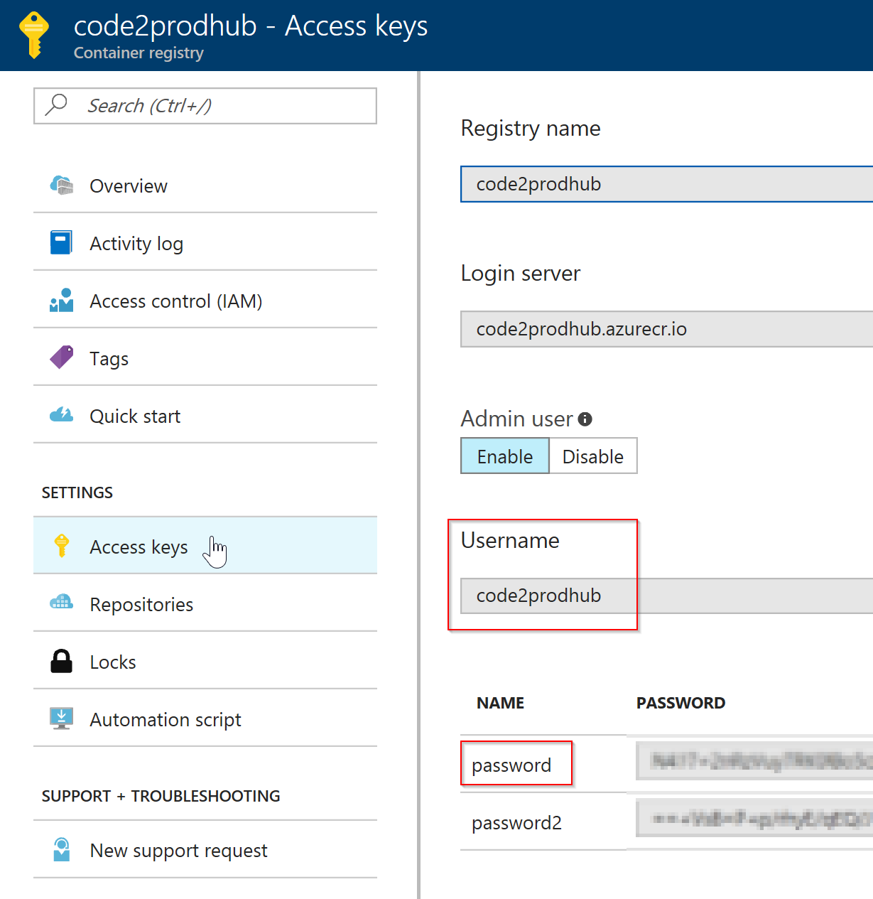

# DWX2017.Workshop

## Setup Container Registry
Create an Azure Contaier Registry:

## Setup Kubernetes Cluster
Execute the [script](CreateCluster.ps1) 

## Add the yaml file to your solution
Add the [yaml sample](deploy.yaml) to your solution and adjust the values to your container and registry.
